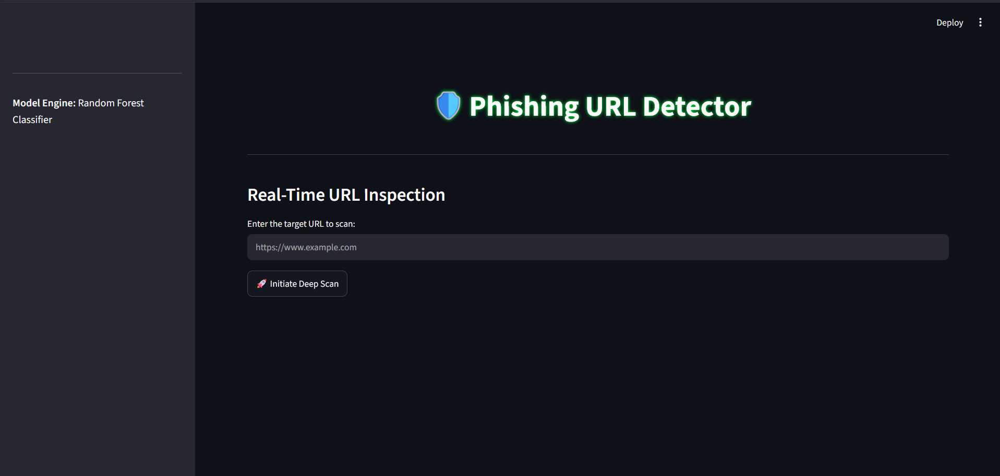

# 🛡️ Phishing URL Detector

### A Real-Time Machine Learning Dashboard for Identifying Malicious and Phishing URLs

## 📖 About The Project
The **Phishing URL Detector** is an advanced cybersecurity intelligence tool designed to protect users, network administrators, and organizations from malicious websites. By leveraging Machine Learning (Random Forest Classifier) and a high-speed feature extraction engine, this tool performs deep lexical, DNS, and WHOIS analysis on any given link. Whether you are conducting security research or simply verifying a suspicious email link, this Streamlit-based dashboard provides a seamless, real-time scanning experience to detect phishing threats with high confidence.


## 📊 Dashboard Preview
Below is a glimpse of the real-time URL inspection interface:



---

## 🚀 Installation & Usage (For Users)
If you simply want to run the application and scan URLs on your local machine, follow these steps:

**1. Clone the repository:**

```bash
git clone https://github.com/your-username/Phishing-URL-Detector.git
cd Phishing-URL-Detector
```

**2. Install the required dependencies:**

```bash
pip install -r requirements.txt
```

**3. Train the Models:**
Before running the UI, execute the training pipeline to generate the required .pkl files based on the dataset:

```bash
python test_compare.py
```

**4. Run the local development server:**

```bash
streamlit run app.py
```

## 🤝 Contributor Expectations
Contributions are what make the open-source community such an amazing place to learn, inspire, and create. Any contributions you make are greatly appreciated.

**To maintain code quality, please follow the standard open-source workflow:**

1. Fork the Project

2. Create your Feature Branch:
```bash 
git checkout -b feature/AmazingFeature
```
3. Commit your Changes: 
```bash
git commit -m 'Add some AmazingFeature'
```
4. Push to the Branch:
```bash
git push origin feature/AmazingFeature
```
5. Open a Pull Request

**Note: Please ensure you open an Issue to discuss significant changes before submitting a Pull Request.**

## ⚠️ Known Issues & Roadmap
While the model is highly accurate, there are a few known limitations that we are actively working on improving:

**WHOIS Timeouts:**
The whois extraction library may occasionally time out depending on the responsiveness of the target domain's server. (Currently handled gracefully via dataset median imputation).

**Zero-Day Attacks:**
The machine learning model requires continuous dataset expansion to consistently recognize highly sophisticated, never-before-seen (Zero-day) phishing attacks.

**Complex URL Edge Cases:**
The model may occasionally misclassify links if they lack a clear, standard domain structure or if the URL is unusually long. We are actively refining our parsing logic to handle these edge cases better.
